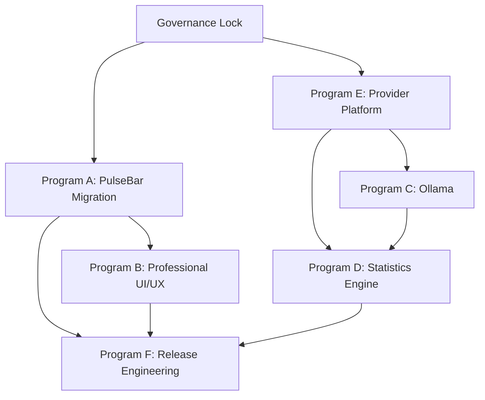

# PulseBar Workstream Dependency Diagram

## Workstreams

| Program | Name | Purpose |
|---|---|---|
| Program A | PulseBar Migration | User-facing identity transition with stable internals. |
| Program B | Professional UI/UX | Incremental UI polish and accessibility improvements. |
| Program C | Ollama | Honest Ollama provider baseline. |
| Program D | Statistics Engine | Evidence-backed historical and statistical usage model. |
| Program E | Provider Platform | Third-party plugin authoring and validation improvements. |
| Program F | Release Engineering | PulseBar release process, artifacts, screenshots, and checksums. |

## Dependency Diagram

## Dependency Rules

1. Governance Lock must merge before any PulseBar implementation.
2. Program A must establish product identity before screenshots, release artifacts, or website copy are updated.
3. Program B may begin after Program A identity foundation, but visual rename and screenshot updates should not race each other.
4. Program C depends on Program E stability because Ollama must use schema v2, explicit `hostCapabilities`, redaction, and provider documentation patterns.
5. Program D depends on provider evidence and should not begin until provider data semantics are stable.
6. Program F depends on whichever product-facing work is included in v0.8.0.

## Workstream Isolation

Each workstream must use a separate branch and worktree.

| Program | Branch Prefix | Worktree Example |
|---|---|---|
| Program A | `feat/pulsebar-*` | `PulseUsage-worktrees/pulsebar-identity` |
| Program B | `feat/pulsebar-ui-*` | `PulseUsage-worktrees/pulsebar-ui` |
| Program C | `feat/ollama-*` | `PulseUsage-worktrees/ollama-provider` |
| Program D | `feat/statistics-*` | `PulseUsage-worktrees/statistics-engine` |
| Program E | `feat/provider-platform-*` | `PulseUsage-worktrees/provider-platform` |
| Program F | `chore/release-*` | `PulseUsage-worktrees/release-engineering` |

## Critical Ordering Constraints

| Constraint | Reason |
|---|---|
| Do not use `release/v0.7.0` for PulseBar work | Release branch is frozen except RC fixes. |
| Do not combine Program A and Program B in one PR | Rename and visual redesign have different risk profiles. |
| Do not combine Ollama with statistics engine | Ollama must first establish evidence-backed provider truth. |
| Do not change bundle identifier in Program A | User data compatibility is locked for v0.8.x. |
| Do not remove v1 plugin compatibility | Third-party compatibility contract. |

## Optional Parallelism

Safe parallel work:
- Program A docs-only identity inventory and Program E plugin authoring docs.
- Program B accessibility audit and Program C Ollama API research.
- Program F release checklist updates after Program A decisions are stable.

Unsafe parallel work:
- Bundle/product identity changes while release engineering changes artifact naming.
- UI screenshot changes before visible identity is final.
- Statistics persistence before provider observation schema is approved.
